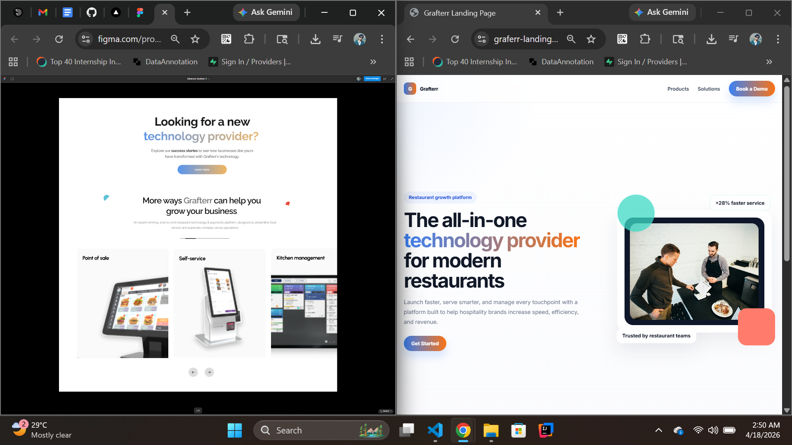

# Grafterr Landing Page — Option A (Vanilla JS)

A fully responsive Grafterr landing page built with semantic HTML, modular CSS, and Vanilla JavaScript using a simulated API layer.

## Chosen Stack
- Vanilla JavaScript (ES Modules)
- HTML5
- CSS3
- Vite

## Setup
```bash
npm install
cp .env.example .env
npm run dev
```

## Build
```bash
npm run build
```

## Approach
- All visible content is loaded dynamically from `data/content.json`
- `js/api.js` simulates a real API with network delay
- Hero and Features sections render skeleton loading states first
- Errors show a retry button
- Carousel supports previous/next navigation and touch swipe on mobile
- Responsive behavior:
  - Mobile: 1 item
  - Tablet: 2 items
  - Desktop: 3 items

## File Structure
```text
css/
  variables.css
  base.css
  components.css
  sections.css
js/
  api.js
  components.js
  carousel.js
  main.js
data/
  content.json
```

## Notes / Assumptions
- Because the assessment requires local JSON with a simulated API, the app intentionally fetches from a local JSON file instead of a third-party API.
- The structure still mirrors a real API service layer, so swapping to a hosted endpoint later is easy using `VITE_CONTENT_URL`.

## Deployment
This project can be deployed on Vercel or Netlify.


## Screenshot Comparison

